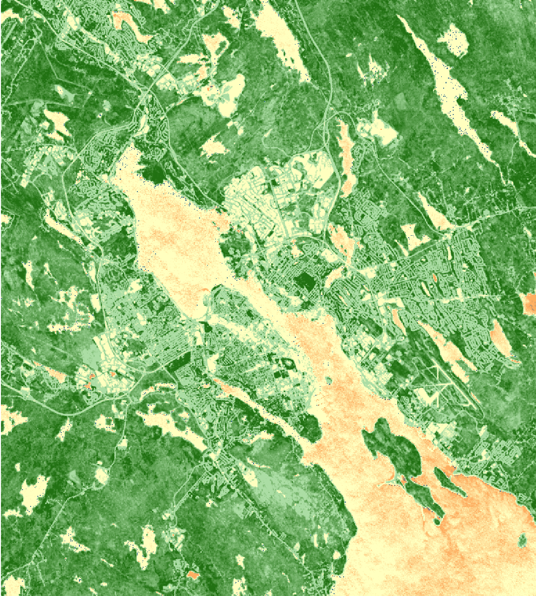
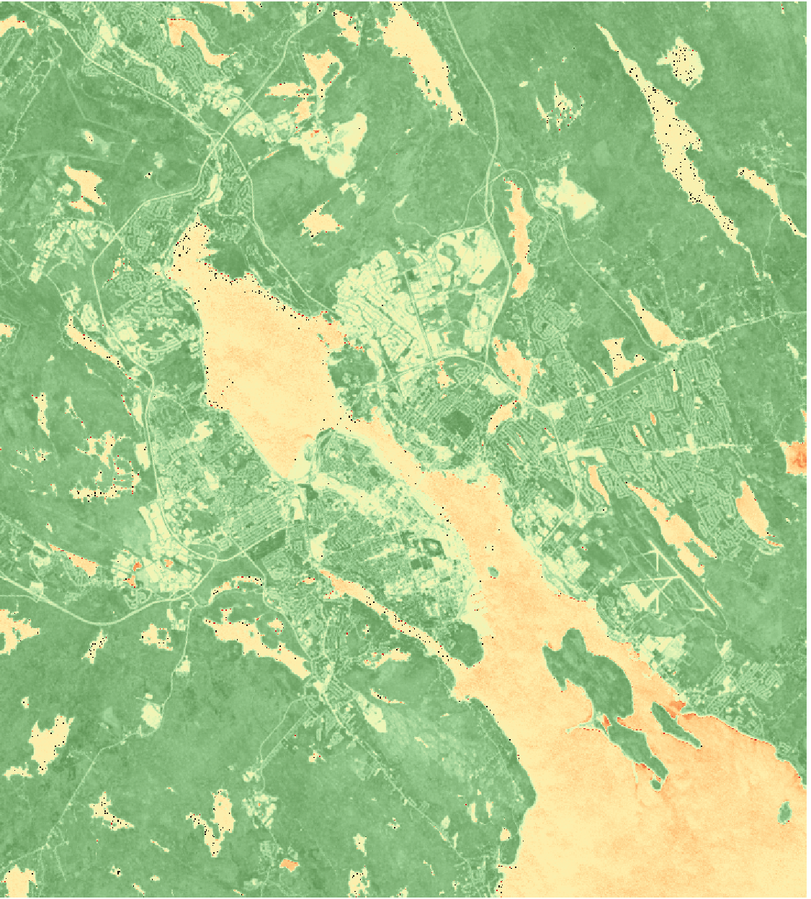

# ndvi
A python function that uses GDAL and numpy to perform an NDVI calculation given a NIR band and a colour band.

User can specify output as a 32-bit floating point image or a 16-bit unsigned integer image.

Comes with a small clipping of a LANDSAT-8 surface reflectance image of Halifax, Nova Scotia, Canada for demo purposes.  You should be able to demo it right out of the box provided the images are in the same directory as the script itself.

Requires osgeo installation of GDAL and numpy (https://trac.osgeo.org/gdal/wiki/GdalOgrInPython)

More info on NDVI: https://en.wikipedia.org/wiki/Normalized_Difference_Vegetation_Index

# 🚀以下为本人实践过程和经验

## NDVI 计算与结果可视化项目说明

### 基于 GDAL 的 NDVI 计算与可视化

1. 原理说明
   
   NDVI = (NIR - Red) / (NIR + Red)
2. 安装环境依赖
   
   **环境准备**

    建议使用 Python 虚拟环境：

    `bash
    python3 -m venv .venv
    source .venv/bin/activate`

    **GDAL,NumPy**

   安装方法：

   在终端输入：

   `python3 -c "import numpy; from osgeo import gdal"`

   安装**NumPy**：

   `python3 -m pip install numpy`

   安装**GDAL**：
    
    `python3 -m pip install GDAL`

    **检查**

    `python3 -c "import numpy; from osgeo import gdal"`

3. 使用方法
   
   在终端运行：

   `python3 ndvi/ndvi_demo.py`

   会生成
   
   `NDVI_INT16.tif`
  
   `NDVI_FLOAT32.tif`
4. 结果展示

   打开`NDVI_INT16.tif`和`NDVI_FLOAT32.tif`调整色彩：

    NDVI_INT16
  
    

    NDVI_FLOAT32

    
